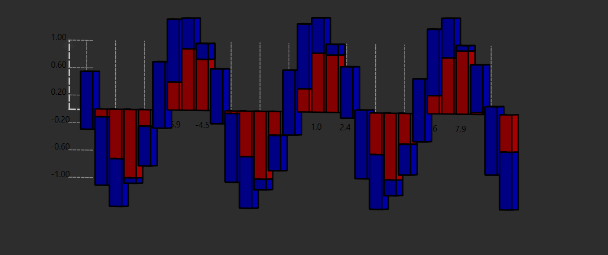
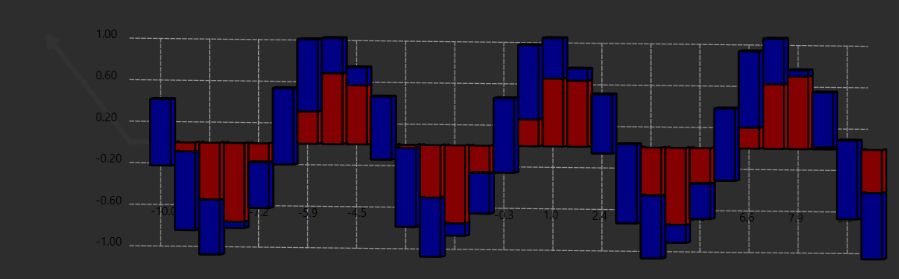
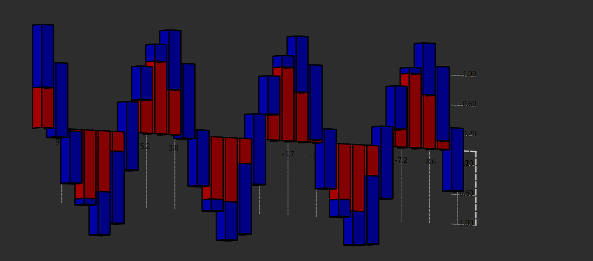

# PyGraphVisualizer
Graph Visualizer With PySide6
📊 3D Гистограмма с Накоплением, Вращением и Масштабированием
🔥 Описание
Эта программа строит 3D-гистограмму на основе переданных данных. Гистограмма поддерживает:
✅ Накопление значений (столбцы состоят из нескольких сегментов)
✅ Вращение графика (перетаскиванием мыши)
✅ Масштабирование (колесиком мыши)
✅ Отображение осей и сетки

# Данные загружаются из data.json, где хранятся значения x и функции.

# Пример испрользования программы, x лежит в пределах от -10 до 10. Функции cos(x), sin(x)

